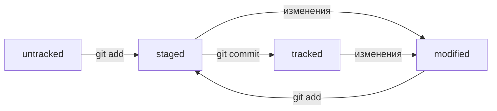

# Cheat sheet for new Git users

## GIT
**Git** - это распределённая система версий.Она позволяет следить за происходящими изменениями, а так же работать над одной задачей одновременно нескольким разработчикам!

C **git** можно работать через **GUI**-оболочки или консольными средсвами.

**GUI** (graphical user interface) - графический пользовательский интерфейс, т.е некоторая программа, в которой представлены все функции для работы с репозиториями в упрощенном для пользователя(разработчика) варианте.В GUI все функции GIT можно реализовать привычным для большинства пользователей способом - с помощью мыши.

**Консольное средство** (к примеру *Git Bash*) - это приложение для ОС Windows, которое представляет утилиты оболочки Unix и возможности для работы с командами командной строки Git.

Простыми словами это некий аналог PowerShell, но предназначенный для непосредственной работы с Git. По внешнему виду это консоль, из которой с помощью ряда программ можно управлять и взаимодействовать с Git.

По функционалу оба этих вида абсолютно идентичны, но история так сложилась, что большинство профессионалов в сфере IT рекомендуют освоить сначала работу с консольным средством (Git Bash).

Научитьтся работать с Git совсем не сложно и даже очень интересно. Научившись основным моментам , вам откроются возможности для дальнейшего ускорения и удобства в разработке. По мне Git - это гениальное решение для ряда задач.

## С чего начать?

### Загрузка/установка

Для начала переходим на сайт [Git](https://git-scm.com/downloads) и скачиваем софт актуальной версии для соответствующей ОС (Win\MacOs\Linux).  
После запуска установщика отсавляем все предустановки сетапера по умолчанию, ничего не меняя нажимаем "дальше" и ждём завершения установки.  
Git Bash установлен!  
Запустив Git Bash, откроется консоль.В ней будет написано :  `$ user-name@PC MINGW64 ~` ($- строка готова к работе, user-имя пользователя, PC- имя компьютера).

### Настройка

Обратите внимание, что в данной теме описана настройка Git для ОС Windows. Настройка Git на MacOS/Linux может отличаться.

Для начала вводим команду `git version`. Она отобразит текущую версию git , установленного на вашем ПК.  
При работе в команде , во избежание путаницы внесенных изменений, нужно представиться и указать пользователя и адрес электронной почты.  
Сделать это можно при помощи команд:  
`git config --global user.name "User_name"`  
`git config --global user.email "User@yandex.ru"`,  
где ключ --global - надстройка, которая применит настройка глобально;    
User_name - указываем имя/ник в кавычках латиницей;  
User@yandex.ru - указываем настоящий e-mail, который вам принадлежит.  

Все глобальные настройки Git хранит в файле .gitconfig , находящийся в домашней директории. Команда запишет в этот файл указашнные имя и почту.  
Чтобы убедиться в успешной настройки данных идентификаций (имя/ник/почта), можно вызвать команду для чтения файлов:  
`cat ~/.gitconfig` или `git config --list`. В ответ консоль выдаст текущие значения настроек.

## Учимся "юзать" Git Bash

Как и в любой программе, при первом запуске юзер обращает внимание на интерфейс, всевозможный функционал и т.д. В Git Bash ,на первый взгляд, кроме консольного окна и строк, ничего нет. Это может смутить и даже испугать начинающего разработчика на старте, как это произошло со мной. Однако это далеко не так. Основным интерфейсом в Git Bash являются команды, ввод которых вызывает определенный функционал.  

### Основные команды

#### Навигация

`cd`(change directory) - смена директории  
`cd ..` - смена директории на уровень выше, в родительскую папку  
`cd~` - переход в домашнюю директорию  
`cd/` - переход в корневую директорию  
`pwd`(present working directory) - отобразить текущую директорию  
`ls`(list directory contents) - отобразить содержимое текущей директории   
`ls -a` - то же самое, что и ls , но флаг -a отобразит еще скрытые файлы    

#### Работа с файлами и папками

`touch index.html` - создать файл index.html в текущей папке. Хорошим тоном считается указывать расширение создаваемого файла.    
`touch index.html style.css script.js` - если нужно создать несколько файлов, можно напечатать их имена в одну строку через пробел  
`mkdir second-project`(make directory) - создать директорию/папку с именем second-project в текущей папке  

#### Копирование и перемещение

`cp file.txt ~/my-dir` - скопировать файл file.txt в директорию my-dir  
`mv file.txt ~/my-dir` - переместить файл file.txt в директорию my-dir

#### Чтение

`cat file.txt` - распечатать содержимое текстового файла file.txt

#### Удаление

`rm about.html` - удалить файл about.html  
`rm dir images` - удалить папку images  
`rm -r second-project` - рекурсивно удалить папку second-project и все ее содержимое

#### Полеззные фичи  

•Команды необязательно печатать и выполнять по очереди. Можно указать их списком - разделить двумя амперсандами (&&)  
•У консоли есть собственная память - буфер с несколькими последними командами. По ним можно перемещаться с помощью клавиш вверх(↑) и вниз(↓)  
•Чтобы не вводить название файла или папки полностью, можно набрать первые символы имени и дважы нажать **Tab**.  
Если файл или папка есть в текущей директории, командная строка допишет путь сама.

### Делаем папку репозиторием - git init

**Репозиторий** (от англ. repository — хранилище) — место, где хранятся и поддерживаются какие-либо данные.  
 Чаще всего данные в репозитории хранятся в виде файлов, доступных для дальнейшего распространения по сети.

 Для лучшей наглядности все дальнейшие манипуляции с консолью будут производиться в домашней директории.

 Для начала отслеживаний изменений Git'ом в проекте, папку с файлами этого проекта нужно сделать Git-репозиторием.Создадим папку (в домашней директории) и присвоим наимонование first-project, далее переместимся в нее и введем некоторые команды:  
 1. `cd ~` - перемещаемся в домашнюю директорию, она же рабочая, в данном задании  
 2. `mkdir first-project` - создаем папку first-project  
 3. `cd first-project` - и переходим в нее  
 4. `git init` - инициализируем текущую директорию как репозиторий  
 
 После этого в папке first-project появится папка, однако вы ее не увидите, т.к. эта папка скрыта.  
 Проверить себя на правильность выполнения вышеперчисленных пунктов можно себя с помощью уже знакомой для нас командой `ls -a`.  
 Консоль выведет содержимое с наименованием ".git" - это папка, в которой содержится вся информация о репозитории.  
 В данном случае особой ценности для нас эта папка не представляет, поскольку репозиторий учебно-тестовый,  
 но в будущем при разработке какого-либо проекта трогать ее не рекомендуется во избежание непредвиденных потерь данных.     
 Все процессы можно ввести одной строкой :  
 `cd ~ && mkdir first-project && cd first-project && git init` - эта рекомендация не обязательна к выполнению. Она всего лишь ускоряет процесс работы с Git'ом.  

### "Разгитить" папку, если что-то пошло не так

Если вдруг случайно сделали гит-репозиторием не ту папку, ее можно "разгитить". Для этого нужно удалить скрытую папку ".git":  

`rm - rf .git` - ключ -r -рекурсивно удаляет папки вместе с их содержимым; ключ -f -принудительно выполняет команду.  
Описанная команда выше удалит инициализацию репозитория, созданную в ранее разобранной теме "git init".  
Поэтому проверив себя на правильность выполнения по удалению .git,  
убедимся в ее отсутствии командой `ls -a`.  
Далее произведем повторную инициализацию : `git init`  

### Проверить состояние репозитория  

`git status` - покажет состояние репозитория, введите ее после инициализации.  
Консоль выведет:  
•название текущей ветки: On branch master/on branch main;  
•сообщение о том, что в репозитории еще нет коммитов: No commit yet;  
•сообщение "nothing to commit(create/copy files and use "git add" to track)" - для коммита(фиксации) создайте или скопируйте файлы  
и используйте команду git add для отслеживания.  

### Добавляем файлы в репозиторий  

В этом уроке создадим два файла и разберем на примере работу git.  

`touch todo.txt` - создаем файл todo.txt  
`touch readme.txt` - создаем файл readme.txt  
`git status` - проверяем статус  

Git сообщит, что в папке first-project есть untracked files(неотслеженные файлы) readme.txt и todo.txt.  
Состояние untracked означает, что Git еще не хранит информацию о версиях файла и не может отследить, как он изменился.  

Сейчас в first-project два файла. Мы хотим отслеживать оба файла, поэтому можем использовать `git add --all` - подготавливает к сохранению все файлы в репозитории.  
Можно и по одному без ключа `--all`:  

`git add todo.txt`  
`git add readme.txt`  
`git status`  

Так же можно добавить всю папку (текущую) целиком. Все файлы в ней тоже будут добавлены:  

`git add .`  
`git status`  

В итоге ,после проделанных манипуляций, высветятся зеленым цветом файлы, которые теперь отслеживаются и готовы к сохранению.  

Команда `git add` не сохраняет содержимое файлов в репозитории. Само сохранение, или фиксацию состояния файлов, называют "коммитом".  
Если сейчас отредактировать любой из "зеленых" файлов в репозитории first-project он перейдет в состояние "modified".  

### Делаем первый коммит  

Коммит - это одна из основных сущностей в Git. Коммит гарантирует, что изменения будут сохранены в истории  
и к ним можно будет "откатиться" при необходимости.  

`git commit -m"сообщение"` -  -m - ключ команды сообщения. "Сообщение" - краткое пояснение об изменениях.

### Историй коммитов  

История коммитов нужна для отслеживания того, что происходит в репозитории, для лучшей навигации в истории изменений.  
Чтобы посмотреть историю, вводим:  

`git log` - выведет коммиты в обратном хронологическом порядке.  

## Знакомство с **GitHub**

До этого момента вы использовали Git локально: сейчас проект first-project хранится только на вашем ПК.  
Однако одно из ключевых преимуществ Git - это удобство совместной работы над файлами.  
Для того, чтобы поделиться поделиться репозиторием нужно завести *удаленную версию*.  

GitHub - платформа для хранения IT проектов и совместной работы над ними.  

### Создаем удалённый репозиторий(после регистрации на Github)

Процесс регистрации в данном материале опущен, т.к. он интуитивно понятен, особых сложностей вызвать не должен.  
Более подробную информацию можете найти в [официальной документации GitHub](https://docs.github.com/ru/get-started/start-your-journey/creating-an-account-on-github).

1. Заходим в свой профиль по ссылке https://github.com/username , username - имя/ник, указанный при регистрации;  
2. Создаём репозиторий. Для этого прееходим на вкладку *Repositories*, а затем нажмите на зеленую кнопку "New";  
3. Откроется окносоздания новогорепозитория. Назовите его. Название удаленного репозитория необязательно должно совпадать с названием локального.  
Другие поля пока вам не понадобятся. Смело жмите "Create Repository".  

Готово! Удаленный репозиторий создан!  
Осталось связать удаленный и локальный репозитории.  

### Генерируем SSH-ключи  

**SSH**(от англ. Secure Shell Protocol) - один из наиболее распространенных сетевых протоколов.  
Он обеспечивает безопасный обменданными в сети. С помщью этого протокола можно получать данные с удаленного компьютера или отправить их на него.  
Трафик шифруется, поэтому он безопасен.  

SSH использует пару ключей для обеспечения безопасности - публичный и приватный:  
•Приватный ключ(private key) - хранится только на вашем ПК и не должен передаваться кому-либо еще.Он используется для расшифровывания данных.  
•Публичный ключ(public key) - доступен всем и используется для расшифровывания.Они могут быть расшифрованы парным приватным ключом.  

#### Проверка наличия SSH-ключа  

Прежде чем генерировать ключи, убедитесь, что у вас их еще нет. По умолчанию директория с SSH-ключами находятся в домашней директории пользователя:  
`cd ~`  
`ls -a .ssh/` -проверяем наличие директории .ssh(имеено в ней хранятся ключи) и файлов в ней.  

Если папка пустая или её нет, все в порядке, но если есть файлы с расширением .pub - удалите их все.  

#### Генерация SSH-ключей  

`ssh -keygen -t ed22519 -C "электронная почта, которой привязан GitHub"` ;  

Если увидели сообщение об ошибке, то скорее всего алгоритм шифрования ed25519 не поддерживается. Используйте другой:  

`ssh -keygen -t rsa -b 4096 -C "электронная почта, которой привязан GitHub"` ;  

После ввода отобразится сообщение в консоле:  

`Generating public/private rsa key pair`  

Далее укажите место хранения ключей. Простой вариант - сделать домашний каталог, путь по умолчанию. Для этого просто нажмите "Enter".  

Затем программа запросит кодовую фразу(passphrase) для доступа к SSH-ключу. Можно оставить поле пустым. Для этого нажмите два раза "Enter" для подтверждения.  

Ключ готов! Теперь проверим  наличие ключей:  

`ls -a ~/.ssh`  

На экране должны появиться два файла ,один из которых с расширением .pub.  
Файл .pub - публичный, им можно делиться с веб-сайтами или коллегами.  
Файл без .pub - приватный. **Ни в коем случае не передавайте его никому!**  

### Привязываеи SSH-ключ к GitHub  

Распечатываем сам ключ в консоли:  

`clip < ~/.ssh/id_rsa.pub`  
или для ed25519  
`clip < ~/.ssh/id_ed25519.pub`  

Если clip не сработал, выведите содержимое с помощью:  

`cat ~/.ssh/id_rsa.pub`
или для ed25519 соответственно 
`cat ~/.ssh/id_ed25519.pub`

Далее скопируйте вывод в буфер обмена из консоли.  

•Переходим в GitHub в пункт Settings(настройки) в меню аккаунта
•В меню слева нажимаем на пункт SSH and GPG keys  
•В открывышемся меню выбираем New SSH key(Новый SSH ключ)  
•В поле Title(заголовок) напишите названия ключа. Например "Personal key"
•В поле key type(тип ключа) должно быть Authentication key(Ключ аутентификации)  
•В поле Key скопируйте ваш ключ из буфера обмена  
•Нажимаем на кнопку Add SSH Key(добавить SSH-ключ)
•Проверяем правильность ключа с помощью команды:  

`ssh -T git@github.com`  
Если это первый раз, когда вы использовали Git, чтобы поделиться проектом на GitHub, появится похожее предупреждение: 

`The authenticity of host 'github.com(140.82.121.4)' can't be established....`  

Это предупреждение сообщает, что вы никогда не соединялись с сервером GitHub, поэтому GitHub не может гарантировать, что сервер является тем, за кого он себя выдает.  
Для подтверждения подлинности сервер генерирует и публикует ключи SHA256. Вы можете [проверить](https://docs.github.com/en/authentication/keeping-your-account-and-data-secure/githubs-ssh-key-fingerprints) ключи GitHub. Если ключ в предупреждении совпадает с тем, что вы видете на сайте, значит сервер является действительным. Введите yes, чтобы продолжить.Вы увидите приветствие на экране.  

### Связываем локальный и удалённый репозиторий  

Переходим на страницу удалённого репозитория. Выберите тип SSH и скопируйте URL.  
Откройте консоль, перейдите в каталог локального репозитория и введите команды:  

`cd ~/dev/first-project` ;  
`git remote add origin git@github.com:%Имя_Аккаунта%/first-project.git`;  

Команде надо передать два параметра: имя удалённого репозитория и его URL. В качестве имени используйте слово origin.  
А URL вы скопировали со страницы удалённого репозитория.  
(*origin*- стандартный псевдоним, с помощью которого можно обращаться к главному удалённому репозиторию, обычно такой репозиторий один - это значительно урощает работу)  

Убедимя, что все работает:  

`git remote -v`  
`origin git@github.com:%Имя_Аккаунта%/%Имя-проекта%.git (fetch)`  
`origin git@github.com:%Имя_Аккаунта%/%Имя-проекта%.git (push)`.  

### Синхронизируем локальный и удалённый репозиторий  

В репозитории может существовать сразу несколько веток - параллельных историй изменений.  
Так же они могут соединяться друг с другом.  

Самая первая ветка в репозитории появляется автоматически и называется main или master. Её имя нужно указывать при отправке коммитов на удалённый репозиторий   
или при получении из него.  

#### Отпарвка изменений на удалённый репозиторий  

После подготовки файлов и коммита с комментариями остаётся загрузить содержимое локального репозитория на GitHub. За это отвечает команда `push`.  
В первый раз эту уоманду нужно вызвать с флагом `-u` и параметрами `origin`(имя удалённого репозитория) и `main/master`(название текущей ветки).  
Флаг `-u` свяжет локальную ветку с одноимённой удалённой:  

`git push -u origin main` (если команда приведётк ошибке, попробуйте заменить main на master)  

В консоле начнёт выводится отладочная информация о количестве обьектов, информация о процессе сжатия и т.д.  
Если вы указывали кодовую фразу её нужо будет ввести.  
Зайдите в репозиторий first-project на GitHub. Вы увидите, что в репозитории появились файлы с изменениями.  
В дальнейшем при работе с удалёнными репозиториями флаг -u можно опустить и писать просто `git push`.  

### Файл Readme.md  

Чтобы другие пользователи, а так же потенциальные клиенты или работодатели понять, что собой представляет проект, его нужно описать.  
Такое описание принято указывать в файле Readme.md  

Как правило, в Readme.md можно найти следующую информацию:  

1. Название проекта и его краткое описание: кем создан, для чего, какие задачи решает и какие закрывает проблемы.  
2. Технологии, которые применяются впроекте: в чём его отличие от  аналогичных.  
3. Документация проекта - подробная инструкция о том, что представляет собой проект.  
4. Планы проекта если они есть.  

## Навигация по коммитам. Статусы файлов  

В процессе работы с Git вам будет часто встречаться понятие хеш коммита.  
Эти строчки с набором букв и цифр вы могли видеть, когда вызывали команду `git log` и выводили историю коммитов.  

### Что такое хеш. "Хеширование коммитов"  

Хеширование (от англ. hash, "рубить", "крошить", "мешанина") - этоспособ преобразовать набор данных и получить их "отпечаток"(fingerprint).  

Информация о коммите - это набор данных: когда был сделан коммит, содержание файлов в репозитории на момент коммита и ссылка на предыдущий или родительский коммит.  

Git хеширует информацию о коммите с помощью алгоритма *SHA-1* (Secure Hash Algoritm - "безопасный алгоритм хеширования") и получает для каждого коммита свой уникальный   
хеш-результат хеширования  

Обычно хеш - это короткая (40 символов в случае SHA-1) строка, которая состоит из цифр 0-9 и латинских букв A-F (неважно,заглавных или строчных).  
Она обладает следующими ваэными свойствами:  
•Если хеш получать дважды для одного и того же набора входных данных, то результат будет гарантированно одинаковый;  
•Если хоть что-то в исходных данных поменяется (хотя бы один символ), то хеш тоже изменится (причем сильно).  

### Хеш - основной идентификатор коммита  

Git хранит таблицу соответствий (хеш → информация о коммите). Если вы знаете хеш, вы можете  
указать все остальное: автора и дату коммита и содержимое закоммиченных файлов. Хещ - основной  
идентификатор коммита.  

При работе с Git хеши будут встречаться вам регулярно. Их можно будет передавать в качестве параметра разным Git-командам,  
чтобы указать, с каким коммитом нужно произвести то или иное действие.  

Все хеши и таблицу (хеш → информация о коммите) Git сохранит в служебные файлы. Они находятся в скрытой папке .git в репозитории проекта.  

### Исследуем лог  

Рассмотрим подробнее, из каких элементов состоит описание коммита, а также как вывести сокращённый лог. Сокращённый лог полезен, если нужно быстро найти нужный коммит среди сотен других.  

#### Элементы описания коммита  

После вызова `git log` появляется список коммитов. В этом списке присутствуют следующие элементы:  

• строка из цифр и латинских букв после слова commit - хеш коммита;  
• Author - имя автора и его электронная почта;  
• Date - дата и время создания коммита;  
• В конце находится сообщение коммита.  

#### Сокращённый лог  

Получить сокращённый лог можно с помощью команды `git log` с флагом `--oneline` (одной строкой).  
В терминале появятся только первые несколько символов хеша каждого коммита и их комментарии.  

Сокращённый лог полезен, если в репозитории уже много коммитов - например, сотни или тысячи. В этом случае можно быстро найти нужный по описанию.  

Сокращённый хеш(т.е. первые несколько символов полного) можно использовать точно так же, как и полный.  
Для этого команда `git log --oneline` автоматически подбирает такую длину сокращённых хешей, чтобы они были уникальными в пределах репозитория и Git всегда мог понять, о каком коммите идёт речь.  

#### Head - всему голова  

При вызове команды `git log` можно увидеть надпись `HEAD → master` после вызова хеша одного из коммитов.  

Файл HEAD - один из служебных файлов папки .git. Он указывает на коммит, который сделан последним(т.е. самый новый).  

Когда вы делаете коммит, Git обновляет refs/heads/master - записывает в него хеш последнего коммита. Получается HEAD тоже обновляется, т.к. ссылается на refs/heads/master  

При работе с Git указатель HEAD используется довольно часто. Мы уже давно упоминали, что многие команды Git принимают в качестве параметра хеш коммита. Если нужно передать последний коммит, то вместо его хеша можно просто написать слово HEAD - Git поймет, что вы имели ввиду последний коммит.  

#### Статусы  

Одна из ключевых задач Git - отслеживание изменения файлов в репозитории. Для этого каждый файл помечается каким-либо статусом:  

•**untracked** - неотслеживаемый. Новые файлы в Git-репозитории помечаются как *untracked*. Git видит этот файл, но не следит за изменениями в нём.  
У untracked-файла нет предыдущих версий, зафиксированных в коммитах или через команду `git add`.  

•**staged** - подготовленный. После команды `git add` файл попадает в *staging area* - список файлов которые войдут в коммит. 
В этот момент файл находится в состоянии *staged*.  
(*staging* area так же называют **index** или **cache**, а состояния файлов *staged* иногда называют **cached** или **indexed**).  

•**tracked** - отслеживаемый. Это противоположность *untracked*. Оно довольно широкое по смыслу: в него попадают файлы,  
которые уже были зафиксированы с помощью `git commit`, а так же файлы, которые были добавлены в *staging area* командой `git add`. Т.е. все файлы,  
в которых Git так или иначе отслеживает изменения.  

•**modified** - изменённый. Это состояние означает, что Git сравнил содержимое файла с последней сохранённой версией и нашёл отличия.  

#### Про *staged* и *modified*  

Команда `git add` добавляет в staging area только текущее содержимое файла. Если, например, сделать `git add file.txt`, а затем изменить file.txt,  
то новое содержимое содержимое файла не будет находится в staging area.  

Git сообщит об этом с помощью статуса modified. Чтобы добавить в staging последнюю версию файла нужно выполнить `git add file.txt` ещё раз.  

Примерная схема цикла смены статуса файлов в Git:  

###  Работа над ошибками в коммитах. Оформление сообщений к коммитам  

То как написаны сообщения коммитов, тоже может подчиняться определённым правилам. Иногда эти правила продиктованы культурой команды, а иногда техническими ограничениями.  

#### Зачем вообще писать сообщения  

Сообщения коммитов можно сравнить с надписями на коробках в кладовке. Если надписей нет, то нужную коробку будет сложно найти:  
придётся заглянуть в каждую, чтобы понять, что там.  

Как и надпись на коробке, сообщение коммита должно помочь определить, что внутри. Например, надпист на коробке "всякое разное" не очень полезная, как и собщение  
коммита "разные исправления" - тоже непонятно, что было исправлено и зачем.  

Общие рекомендации для правильного составления сообщения:  
•Оно должны быть относительно коротким, чтобы его легко можно было прочитать;  
•Информативность.  

#### Стили оформления  

Все люди разные и у всех есть предпочтения - в т.ч., как формулировать сообщения коммитов.  
Кто-то использует инфинитивы: "исправить сообщение об ошибке №3", кто-то - глаголы в прошедшем времени: "исправил...", кто-то существительные: "Исправление..." и т.д.  

Чтобы упростить работу, команды или даже целые компании часто договариваются об определённом стиле(правилах) оформления коммитов.  
Вот некотроые популярные подходы к оформлению:  

•**Корпоративный**. К примеру, во многих компаниях используется *Jira* - система для организации проектов и задач. У каждой задачи в Jira есть идентификатор из нескольких  
заглавных латинских букв и номера:  
`LGS-239 "Исправить ошибку №2 в задаче 239"` - означает, что это 239-я задача в проекте LGS (сокр. от logistics).  
В корпоративном стиле в начале указывают Jira-ID, а после текст сообщения.  

•**Conventional Commits**. Этот подход отличается качественной документацией и подробной проработкой. Он подходит для репозиториев с исходным кодом программ.  
Использовать его для других типов проектов было бы неудобно. Conventional Commits предлагает следующий формат коммита:  
`<type>:<сообщение>` - где первая часть `<type>` - это тип изменений. Подобных типов достаточно много. Более подробно ознакомиться с ними можно на [сайте](https://www.conventionalcommits.org/en/v1.0.0/).  
`git commit -m "feat: добавить расчёт суммы заказов за день"`  

•**GitHub стиль**. GitHub можно использовать не только для хранения файлов, но и для ведения списка задач(*issue*) этого проекта.  
Если коммит закрывает или решает какую-то задачу, то в его сообщении удобно указывать ссылку на неё (`<номер задачи>`):  
`git commit -m "Исправить #334, добавить график валюты"`  
В таком случае GitHub свяжет коммит и задачу.  

##### Инфинитив и императив  

Для сообщения на русском языке часто рекомендуют использовать инфинитивы:  
`добавить тесты для WebService`, `Исправить ошибку №123` и т.д.  

Для сообщений на английском языке рекомендуется использовать повелительное наклонение:  
`use library mega_lib_300` , `Fix exit button` и т.д.  

#### Как исправить коммит  

Иногда в только что выполненном коммите нужно что-то поменять: например, добавить ещё пару файлов или заменить сообщение на более информативное.  

В таком случае можно внести правки в уже сделанный коммит с помощью опции `--amend`(от англ. "справить", "дополнить") у команды `git commit --amend`.  
**Опция --amend работает только с последним коммитом (HEAD)**. Для исправления более ранних коммитов есть другие команды.  

`git commit --amend --no-edit` ипользуется, когда коммит нужно дополнить файлами, не вошедший в индексирование по той или иной причине.  
При этом команда не создаёт новый коммит, а дополняет последний с последующим изменением хеша, т.к. изменится список файлов в коммите.  
Опция `--no-edit ` сообщает команде, что сообщение коммита нужно оставить без изменений.  

Точно так же можно добавить не новый файл, а дополнительные изменения, в уже добавленном коммите.  

#### Изменить сообщение коммита  

`git commit --amend -m "новое сообщение"` - данная команда меняет сообщение последнего коммита.  
При этом хеш коммита изменится, т.к. изменилось сообщение и время коммита.  

#### Откат назад  

На разных этапах работы с Git могут происходить подобные ситуации:  

• в список на коммит попал лишний файл (например, временный). Нужно "вынуть" его из списка.  
• последние несколько коммитов ошибочные: например, сделали не то, что было нужно, или нарушили "логику". Хочется "откатить" сразу несколько коммитов, вернуть "как было вчера".  
• случайно изменился файл, который вообще не должен быо меняться. Например, вы открыли не тот файл в редакторе и начали его исправлять.  

#### Выполнить unstage изменений  

Допустим, вы создали или изменили какой-то файл и добавили его в список "на коммит" (staging area) с помощью `git add`, но потом передумали включать его туда.  
Убрать файл из staging area поможет следующая команда:  

`git restore --staged <file>`  

Чтобы сбросить все файлы из staged обратно в untracked/modified, можно воспользоваться командой  
`git restore staged .`, которая сбросит всю текущую папку.  

#### Откатить коммит  

Иногда нужнл откатить то, что было уже закоммичено, т.е. вернуть состояние репозитория к более раннему:  

`git reset --hard <commit hash>`. Указанный коммит/хеш в `<commit hash>` станет последним. От него будет вестись вся дальнейшая разработка. А коммит, с которого делали откат, Git просто удалит.  
**!Будьте осторожны с командой `git reset --hard`. При удалении коммитов можно потерять что-то нужное!**  

#### Откатить изменения, которые не попали ни в staging, ни в коммит  

Может быть так, что вы случайно изменили файл, который не планировали. Теперь он отображается как modified.  Чтобы вернуть его в исходную версию нужно выполнить:  

`git restore <file>` - изменения в файле отменятся до последней версии, сохраненных через `git commit` или `git add`.  

## Просмотр изменений. Игнорирование файлов  

При работе с Git часто нужно узнать, что конкретно изменится или уже изменилось после того или иного коммита. Вот примеры:  

• Вы собираетесь сделать коммит, но хотите перепроверить какие именно изменения в него попадут.  
• Вчера ваш коллега сделал коммит с сообщением "Small fix", после чего тесты проекта начали падать. Чтобы разобраться в ситуации нужно посмотреть, что изменилось в этом коммите.  

Всё это позволит сделать команда `git diff`. Вывод этой команды содержит информацию о том, какие строки были удалены, добавлены или сохранены.  

`--staged` - позволяет просматривать изменения в staged-файлах.  
Строки `--- a/fileA.txt` и `+++ b/fileA.txt` говорят, что дальше будет выведен результат сравнения файлов `a/fileA.txt` и `b/fileA.txt` исходной и текущей версии.  
Строка `@@ -1,2 +1,2 @@` сообщает, какие строки попали в сравнение. Выражение `1,2`(неважно, с плюсом или с минусом) говорит, что были использованы две строки, начиная с первой. Если было бы, к примеру, написано `@@ +15,7 @@`, это значило бы, что в сравнении участвуют *7 строк начиная с 15-ой*.  

### Сопостовляем коммиты  

Если вдруг на каком-то этапе работы возникнет проблема, это поможет разобраться, что конкретно изменилось, в одном коммите по сравнению с другим.  

#### Дописываем строку в файл  

`echo` - сама по себе эта команда просто выводит в консоль то, что ей передали в качестве параметра. Параметр передается в кавычках, непосредственно после самой команды -  `echo "something value"`. Но если скомпилировать с символами перенаправления вывода `>>`, то все, что должно было попасть на экран, вместо этого будет записано в файл:  

`cat file.txt`
`Первая строка файла`  

`есho "Вторая строка файла" >> file.txt`  
`cat file.txt`  
`Первая строка файла`  
`Вторая строка файла`  

Оператор `>>` - это возможность командной строки Bash. Его можно использовать не только с echo, но и с любой другой командой, которая выводит что-то на экран.  
Одинарный оператор `>` тоже перенаправляет вывод команды в файл, но перед этим сотрёт содержимое файла, т.е. перезапишет файл целиком.  

#### Сравниваем коммиты  

Чтобы сравнить коммиты нужно передать хеши сравниваемых коммитов в команде `git diff`. Состояние файлов на момент переданного коммита будет сравниваться с состоянием на момент второго:  

`git diff 1c29af6 48fe3dc` - Вместо хеша можно использовать `HEAD`, если такое имеет место быть.  

В выводе черные строки без знаков "+" или "-" - это контекст, его git diff выводит только для того, чтобы стало понятно, что находится рядом с измененными (зелёными и красными) строками.  

#### Порядок аргументов  

`git diff A B` выводит список превращения состояние A в состояние B. Если поменять A и B местами, то и инструкции будут обратные. При этом все зеленые строки станут красными и наоборот.

